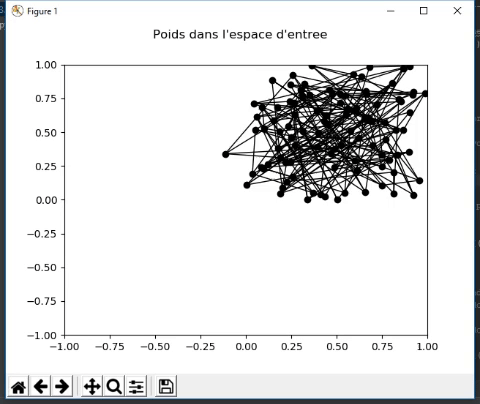
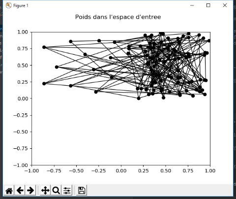
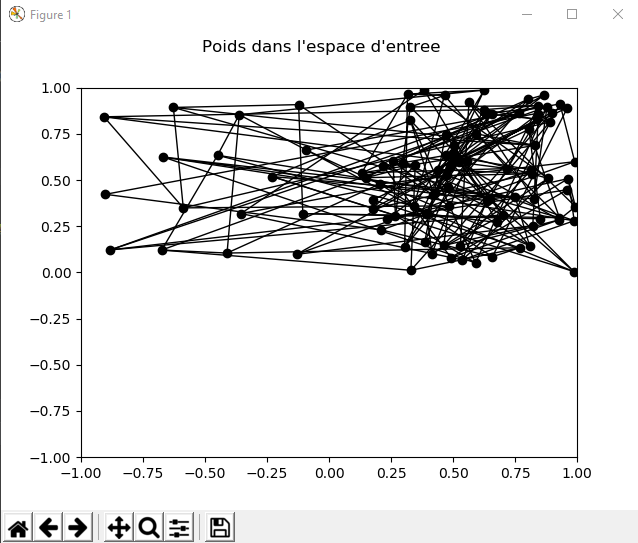
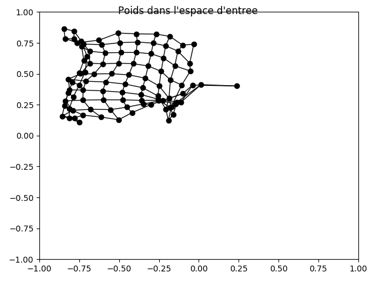
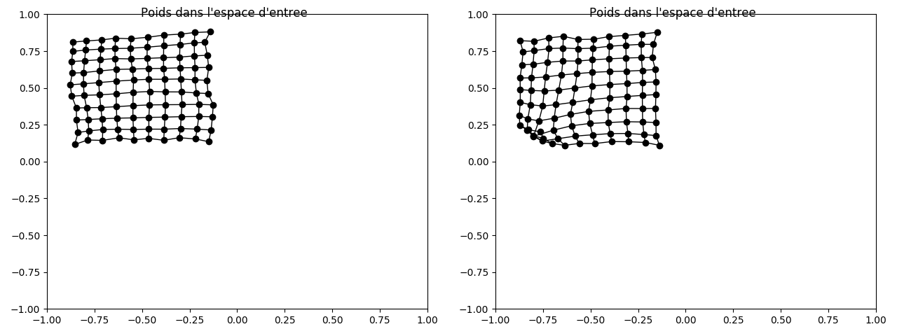
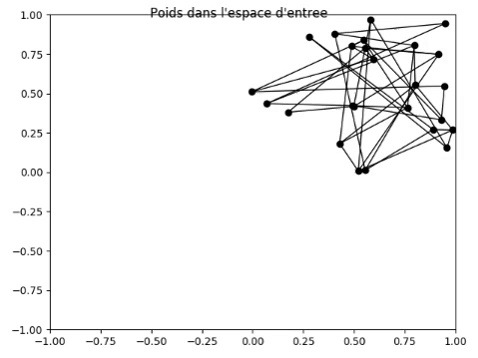
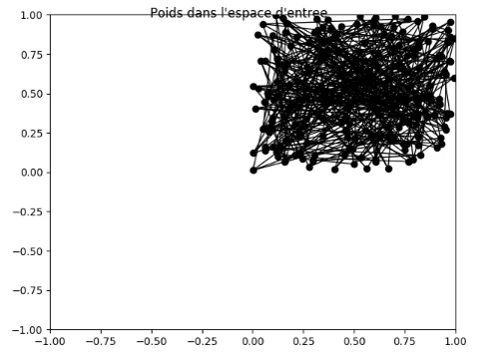
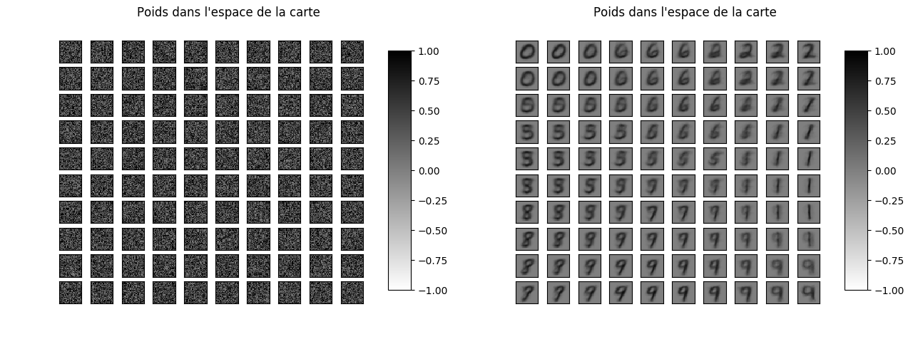

# Intelligence artificielle : Réseaux de neurones

### Equipe

Yannis Bacha & Pierre Chat

## Question 1

> Quelle sera la prochaine valeur du poids du neurone gagnant dans le cas où η = 0 ?

Si η est nul, la prochaine valeur du poids du neurone gagnant restera inchangée.

> Quelle sera la prochaine valeur du poids du neurone gagnant dans le cas où η = 1 ?

Si η vaut 1, la prochaine valeur du poids du neurone gagnant sera égale à la valeur tirée. Chaque neurone n'apprend
seulement que de la dernière entrée.

> En déduire géométriquement la prochaine valeur du poids dans le cas normal où η ∈ ]0, 1[.

Plus η tend vers 0, moins le poids du neurone va être modifié. Plus η tend vers 1, plus le poids va être modifié.

> Si σ augmente, est-ce que les neurones vont plus ou moins apprendre l’entrée courante ?

Si σ augmente, les neurones vont plus apprendre de l'entrée courante. Dans la formule, une valeur de σ plus importante
implique que l'exponentielle se rapproche de 1.

> En déduire l’influence que doit avoir σ sur la “grille” de neurone, sera-t-elle plus “lâche” ou plus “serrée”
si σ augmente ?

Si σ augmente, la grille apparaitra alors plus serrée car les neurones voisins seront plus influencés par le neurone
gagnant.

> Prenons le cas d’une carte avec un seul neurone qui reçoit 2 entrées x1 et x2 . Durant l’apprentissage x1
(respectivement x2) est présenté n1 (respectivement n2) fois. Après l’apprentissage où se situera
géométriquement le poids du neurone ?

Si n1 est largement supérieur à n2, le poids du neurone se trouvera nettement plus proche de x1 et inversement.
Si n1 et n2 sont à peu près égaux et suffisemment grands, le poids du neurone se trouvera entre x1 et x2.

## Question 2

```python
def compute(self, x):
    self.y = numpy.sqrt(numpy.sum((x - self.weights) ** 2))
```

```python
def learn(self, eta, sigma, posxbmu, posybmu, x):
    exp = -((numpy.sqrt((self.posx - posxbmu) ** 2 + (self.posy - posybmu) ** 2)) / 2 * (sigma ** 2))
    self.weights[:] += eta*numpy.exp(exp)*(x-self.weights)
```


## Question 3

> Influence des éléments suivants sur le fonctionnement de l’algorithme de Kohonen

#### Référence : η = 0.05 | σ = 1.4 | N = 30000 |


- taux d’apprentissage η

Il s'agit de la vitesse à laquelle les neurones vont converger vers la solution tirée. Plus η tendra vers 1 plus les poids des
neurones sera modifié et donc convergera plus vite et inversement.



On voit bien qu'avec η = 0.25 les poids convergent bien plus vite.

Nous avons constaté qu'un taux d'apprentissage élevé augmentait le risque d'une grille mal formée (en forme de noeud
papillon) à cause d'une convergence trop rapide.

- largeur du voisinage σ

Si on augmente σ, les noeuds seront plus éparpillés sur la grille.



Avec σ = 10 on voit que dès le premier rafraichissement, une partie des neurones convergent vers la solution mais
qu'une grande partie d'entre eux n'ont pas leur poids qui évolue et donc restent sur place.

Après avoir relancé l'algorithme et attendu la fin du traitement, on peut obtenir une carte comme ci-dessous.



On voit bien qu'après 30001 boucles, on se retrouve avec des neurones qui n'ont pas beaucoup appris, voir pas du tout.

- nombre de pas de temps d’apprentissage N

Le pas d'apprentissage influe sur le nombre d'itérations laissées à l'algorithme pour converger. Ici, on peut
voir que 3000 itérations ne sont pas suffisantes pour que la grille soit bien placée.



Un nombre N trop important n'apportera rien, puisque la grille sera déjà bien placée, les changements ne seront que
mineurs.



Ci-dessus, voici deux résultats pour 10000 itérations. On voit que dans certains cas, la convergence n'est pas
parfaite. Cela dépend des valeurs aléatoires tirées.

- taille de la carte

Voici une grille de 5x5 neurones. La convergence est très rapide mais avec les paramètres de base, la grille ne
couvre pas toutes les données. Il faut légèrement augmenter la largeur du voisinage.



Voici une grille de 15x15 neurones. Avec 10000 itérations, la convergence n'est pas terminée. La couverture est bien
meilleure mais les chances de mauvaise convergence sont élevées car les neurones sont trop proches. Afin d'obtenir
le résultat ci-dessous, nous avons dû essayer plusieurs fois, la grille étant souvent repliée sur elle-même.



- Jeu de données MNIST



A partir de la base de données d'images, on entraîne une grille de 10x10 neurones. Au départ, chaque neurone a
en entrée du bruit. A la fin, on peut distinctement identifier plusieurs chiffres. Les chiffres qui se ressemblent
sont flous. Le réseau fait difficilement la différence entre les 3 et les 5, les 1 et les 7.
