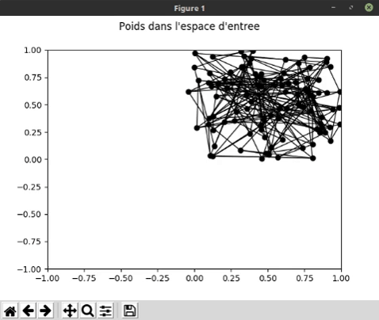

# Intelligence artificielle : Réseaux de neurones

## Question 1

> Quelle sera la prochaine valeur du poids du neurone gagnant dans le cas où η = 0 ?

Si η est nul, la prochaine valeur du poids du neurone gagnant restera inchangée.

> Quelle sera la prochaine valeur du poids du neurone gagnant dans le cas où η = 1 ?

Si η vaut 1, la prochaine valeur du poids du neurone gagnant sera égale à la valeur tirée. Chaque neurone n'apprend
seulement que de la dernière entrée.

> En déduire géométriquement la prochaine valeur du poids dans le cas normal où η ∈ ]0, 1[.

> Si σ augmente, est-ce que les neurones vont plus ou moins apprendre l’entrée courante ?

Si σ augmente, les neurones vont plus apprendre de l'entrée courante. Dans la formule, une valeur de σ plus importante
implique que l'exponentielle se rapproche de 1.

> En déduire l’influence que doit avoir σ sur la “grille” de neurone, sera-t-elle plus “lâche” ou plus “serrée”
> si σ augmente ?

Si σ augmente, la grille apparaitra alors plus serrée car les neurones voisins seront plus influencés par le neurone
gagnant.

## Question 2

